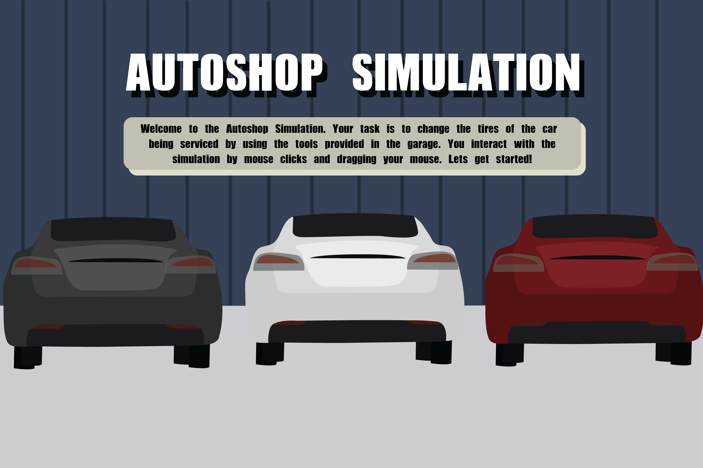

# Autoshop-Simulation
Interactive Arts and Technology - IAT265 Final Project

[Video Demo](https://youtu.be/B6oibWV_8uw)

<h2>Simulation Overview</h2>
The autoshop simulation allows the user to go through and act as a car mechanic where they change the tires of the car that requires service.  The simulation is complete with various different animations, detailed visuals and graphics, and realistic sound effects for a quality experience. 